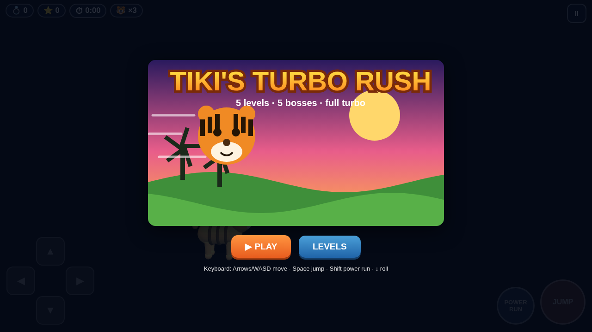

# games

Family-friendly browser games. Each folder is one game — play them at the Pages site.

## 🐯 Tiki's Turbo Rush

**A 3D mobile Sonic-style platformer starring Tiki the Tiger.** Run, spin-jump and power-run through 5 themed worlds — jungle, deep reef, haunted hills, volcano vault and neon city — dodging walker bots, spike balls and crushers, collecting rings, and grabbing three power-ups (Super Speed, Jetpack, Invincibility). Five 3-hit bosses, one per level, ending with Mecha-Tiger. Built with Three.js (3D primitives only — no art assets), touch-first controls that work in portrait and landscape, and chiptune audio generated in code.

**QR-friendly tagline:** *Scan → run, spin and boost through 5 worlds with Tiki the Tiger. Free, no install, works on your phone.*

▶ **Play now:** [tiki-turbo-rush/](tiki-turbo-rush/)

### More games

- [Star Bed](star-bed/) — cozy space critter-catching for little kids
- [Hot Dog Mallow Jump](hot-dog-mallow-jump/) — a doodle-jump with a hungry hot dog
- [Max's Birthday Dodgeball](maxs-birthday-dodgeball/) — 3D dodgeball boss battles
- [Jelly Jump](jelly-jump/) — jellyfish arcade climbing
- [Soccer Stars](soccer-stars/) · [Neon Culling](neon-culling/) · [CS-FPS](cs-fps/) · [Guineacup Cafe](GuineaCup_Cafe/) · [Poison Honey Rescue](Poison_Honey_Rescue/)
